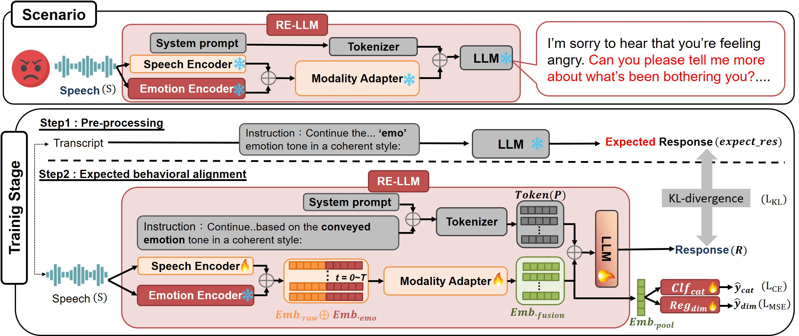

# RE-LLM: Refining Empathetic Speech-LLM Reponses by Integrating Emotion Nuance Modeling

## Overview


The architecture of our proposed RE-LLM comprises a speech-LLM and an emotion nuance module. A preprocessing generation and expected behavioral alignment constrained on nuance emotion training strategy are depicted as well.

## Abstract
As generative AI advances, enhancing empathy in human-AI interactions is crucial. While prior work focuses on emotional reflection, emotional exploration—key to deeper engagement—remains overlooked. Existing LLMs rely on text or ASR-transcript embeddings, which capture limited emotion nuances. To address this, we propose RE-LLM, a speech-LLM integrating dimensional emotion embeddings and auxiliary learning. Experiments show significant gains in computational empathy, with RE-LLM relatively improving the “Emotional Reaction” score by 14.79% and 6.76% compared to text-only and speech-LLM baselines on ESD, and slightly on IEMOCAP. Notably, it relatively enhances the “Exploration” score by 35.42% and 3.91% on IEMOCAP and 139.28% and 9.83% on ESD. Additionally, it boosts unweighted accuracy by 5.4% on IEMOCAP and 2.3% on ESD in speech emotion recognition. These results highlight the enriched emotional understanding and improved empathetic response generation of RE-LLM.

## Getting Started
### 0. Environment Setup
Ensure that the following dependencies are installed:
```bash
pip install -r requirements.txt
```
### 1. Prepare pretrained model
1. We train the RE-LLM from the pretrained BLSP-Emo checkpoint released in [BLSP-Emo](https://github.com/cwang621/blsp-emo.git)
2. Emotion Encoder : we use the wav2vec 2.0 from the checkpoint in [w2v2-how-to](https://github.com/audeering/w2v2-how-to.git)

### 2. Training the Model
The following training process is the same as the BLSP-Emo

**Pre-processing：**
Leverage Qwen-7B to generate the continuation.
```bash
python -u emotion_text_generation_RELLM.py generate \
    --qwen_path ${qwen_path} \
    --manifest examples/train/train_iemocap.jsonl \
    --lab_dir examples/train/emotion_labels \
    --nshard 1 \
    --rank 0 \
    --use_emotion True
```
**Clean the continuations**
```bash
python data_process/clean_noise_examples.py \
    --input_dir examples/train/emotion_labels
```
**Offline process**
```bash
emotion_instruction="Continue the following sentence based on the conveyed emotion tone in a coherent style: "

python src/instruction_dataset_RELLM.py offline \
    --dataroot examples/train/emotion_labels \
    --manifest_files "*_clean.jsonl" \
    --lm_path ${qwen_path} \
    --save_dir examples/train/emotion_labels/processed \
    --instruction_field "instruction" \
    --audio_instruction "$emotion_instruction" \
    --audio_field "audio" \
    --input_field "text" \
    --output_field "output" \
    --max_length 256 \
    --max_duration 30.0 \
    --num_proc 64 \
    --use_emotion True
```

**Train the RE-LLM model:**

```bash
bash scripts/train_RELLM.sh
```

### 3. Inference

Response Generation

```bash
python3 generate_RELLM.py \
    --input_file "examples/test/test_alpaca.jsonl" \
    --output_file "examples/test/output_alpaca.jsonl" \
    --blsp_model $blsp_path \
    --instruction "" \
    --audio_field "audio" \
    --max_new_tokens 256 \
    --batch_size 4 \
    --use_emotion True
```

SER evaluation
```bash
instruction="Please identify the emotion tone of the speech provided below. Select from the following options: neutral, sad, angry, happy, or surprise.

Speech: "

python3 generate_RELLM.py \
    --input_file "examples/test/test_iemocap.jsonl" \
    --output_file "examples/test/output_iemocap.jsonl" \
    --blsp_model $blsp_path \
    --instruction "$instruction" \
    --audio_field "audio" \
    --reference_field "emotion"
```

### 4. Evaluate empathetic score with ER/EX

Evaluate model performance with a computable empathy [metric](https://github.com/behavioral-data/Empathy-Mental-Health.git)
